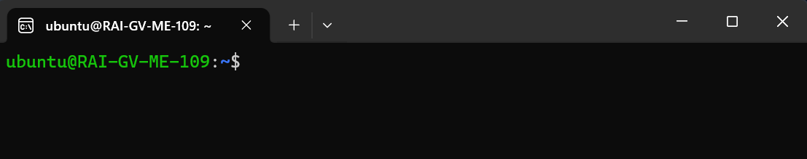
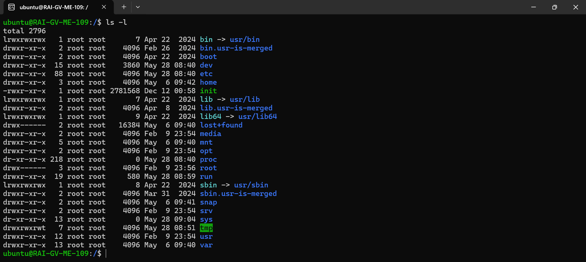
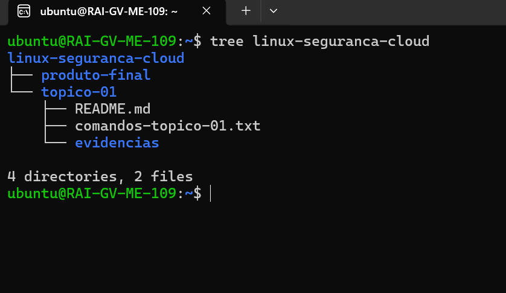
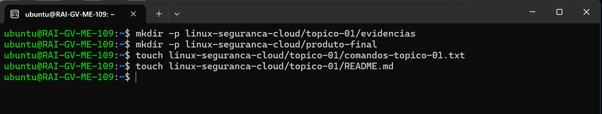

## Atividade prática 1

### Ambiente utilizado
    - O trilho escolhido para a tarefa foi Trilho A - VM local 
    - Ubuntu 24.04 (WSL2)

## Objetivo desta atividade
    - Identificar e preparar o ambiente Linux
    - Utilizar o terminal Linux
    - Executar comandos básicos
    - Criar uma estrutura de diretórios organizada
    - Registar comandos utilizados
    - Guardar evidências (prints)
    - Criar documentação inicial do projeto

### Estrutura do diretório 

## Comandos executados

mkdir -p	        cria pastas em estrutura
touch	            cria ficheiros vazios
tree	            mostra estrutura de pastas
sudo apt install	instala programas no Linux

## Alguns dos comandos utilizados nesta atividade:

    - mkdir -p linux-seguranca-cloud/topico-01/evidencias/imagens
    - mkdir -p linux-seguranca-cloud/produto-final
    - touch linux-seguranca-cloud/topico-01/comandos-topico-01.txt
    - touch linux-seguranca-cloud/topico-01/README.md
    - tree linux-seguranca-cloud
    - sudo apt install tree -y

## Diferença entre VM, VPS e infraestrutura em nuvem
VM (Virtual Machine)

É uma máquina virtual que roda dentro de um servidor físico. Simula um computador completo (CPU, RAM, disco, sistema operativo). Pode ser usada localmente ou na cloud.

VPS (Virtual Private Server)

É uma VM “alugada” num servidor de um fornecedor. Funciona como um servidor dedicado, mas partilha o hardware com outras VPS. Muito usada para alojar sites e aplicações.

Infraestrutura em nuvem (Cloud)

É um conjunto de recursos (VMs, armazenamento, redes, serviços) fornecidos sob demanda pela internet. Permite escalar facilmente, pagar só o que usa e gerir tudo remotamente.

## Dificuldades encontradas
nenhuma a relatar.

## Próximos passos

Tendo em conta das limitações do wsl2, estar pronto para mudar para Virtual Box, caso for necessário de modo a acompanhar todas as tarefas do modulo.