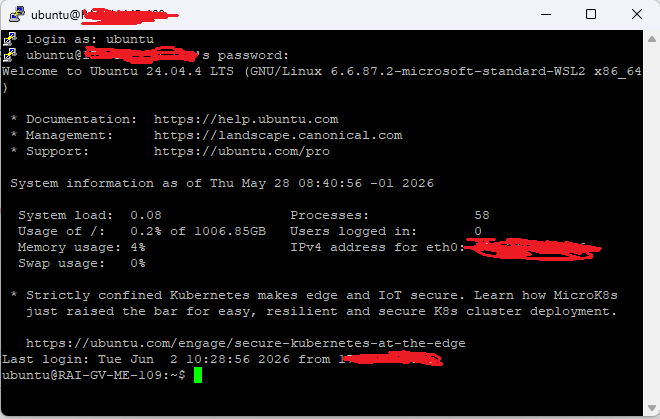
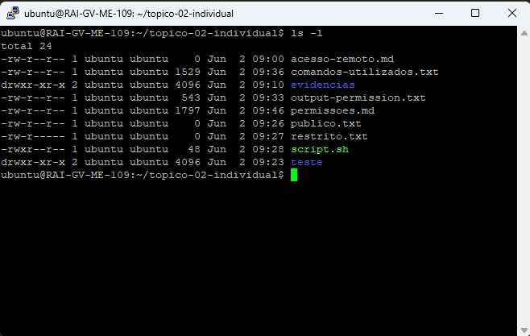

# Acesso remoto e chaves SSH




## Diferença entre autenticação por palavra-passe e autenticação por chave

A autenticação por palavra-passe baseia-se na introdução de um utilizador e uma password que é verificada no servidor. 
Este método é simples, mas mais vulnerável a ataques como força bruta, phishing ou reutilização de palavras-passe.

A autenticação por chave SSH utiliza um par de chaves criptográficas (pública e privada). O servidor guarda a chave 
pública e o utilizador mantém a chave privada em segurança. A autenticação ocorre através de um processo criptográfico, 
sem necessidade de enviar a palavra-passe pela rede, tornando-se mais segura e resistente a ataques.


## Cuidados de segurança
   Nunca partilhar a chave privada.
   Proteger a chave com password (passphrase).
   Usar permissões restritas no diretório .ssh
   Remover chaves antigas ou não utilizadas.
   Evitar copiar chaves para sistemas não confiáveis.


## Chave pública

A chave pública pode ser partilhada com servidores remotos. Ela é colocada no ficheiro:

```text
~/.ssh/authorized_keys

