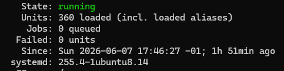
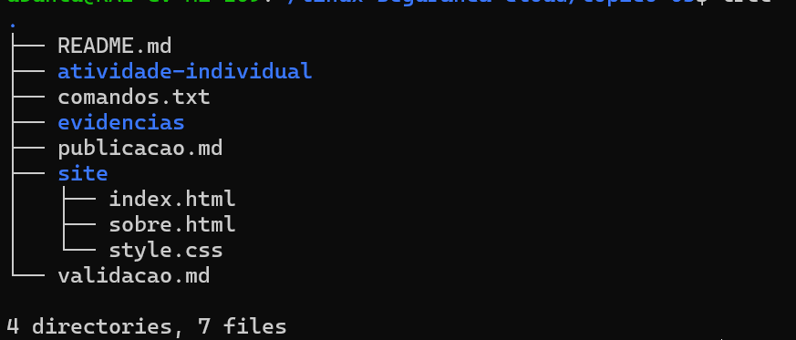

# Validação
## URLs testados
o site foi acessado atravez do ip da maquina no browser

## Resultado dos testes

## Evidências

### diretorio de pastas

### pagina index - principal

### pagina sobre

## Observações
nada a observar
