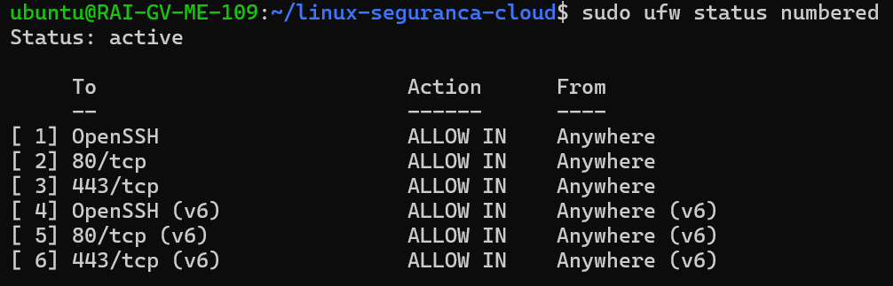
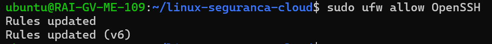
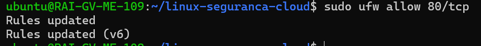
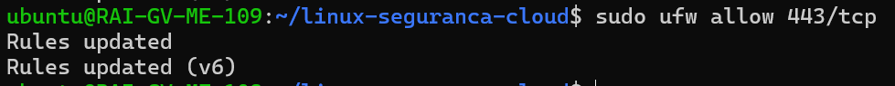

# Configuração do Firewall

## Objetivo

Verificar a existência do UFW (Uncomplicated Firewall), configurar as regras necessárias para o acesso aos serviços e documentar o estado final do firewall.

## Ambiente

* Sistema: Ubuntu em WSL2
* Tipo de ambiente: Desenvolvimento local

## Verificação do UFW

Foi efetuada a verificação do estado do UFW atraves do comando:

- sudo ufw status numbered

## Regras pretendidas

UFW, foram aplicadas as seguintes regras:

### SSH

- sudo ufw allow OpenSSH

### HTTP

sudo ufw allow 80/tcp

### HTTPS (quando configurado)

- sudo ufw allow 443/tcp

### Ativação

- sudo ufw enable

### Verificação

- sudo ufw status numbered

## Estado Final

* UFW não instalado no ambiente WSL2.
* Firewall gerido pelo Windows Defender Firewall.
* Não foram aplicadas regras UFW devido à indisponibilidade da ferramenta.
* O acesso aos serviços continua dependente da configuração de rede do Windows.
