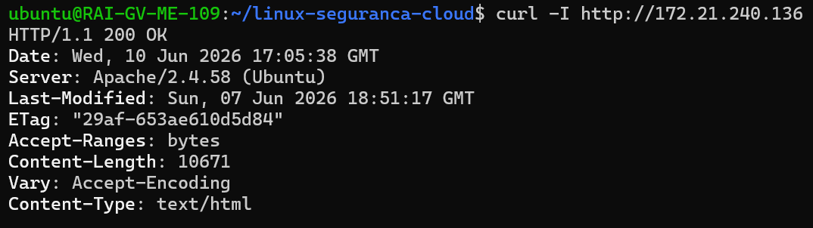
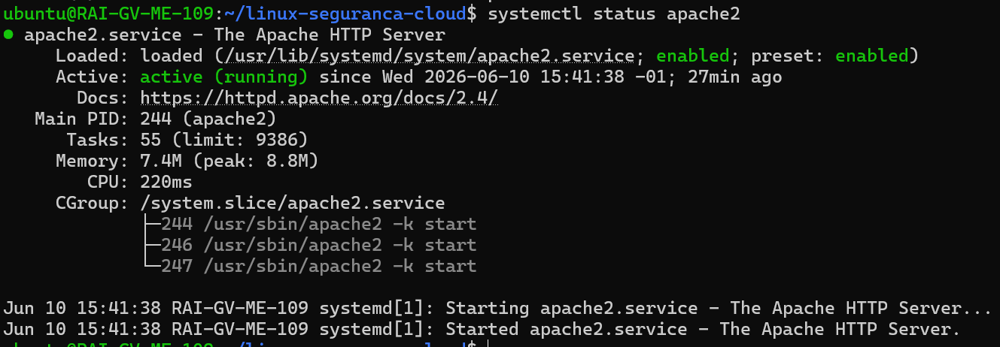

## Validação do Firewall e Serviço Web

# Objetivo

Validar o funcionamento do serviço web após tentativa de configuração de firewall e confirmar a acessibilidade dos serviços no ambiente WSL2.

#Teste do serviço web local

 Foi efetuado teste de conectividade ao serviço web local.

#Comando:

curl -I http://ip-da-maquina

Resultado:

HTTP/1.1 200 OK

Conclusão: o serviço web está ativo e a responder corretamente.

Validação de Apache

systemctl status apache2

Apache rodando

